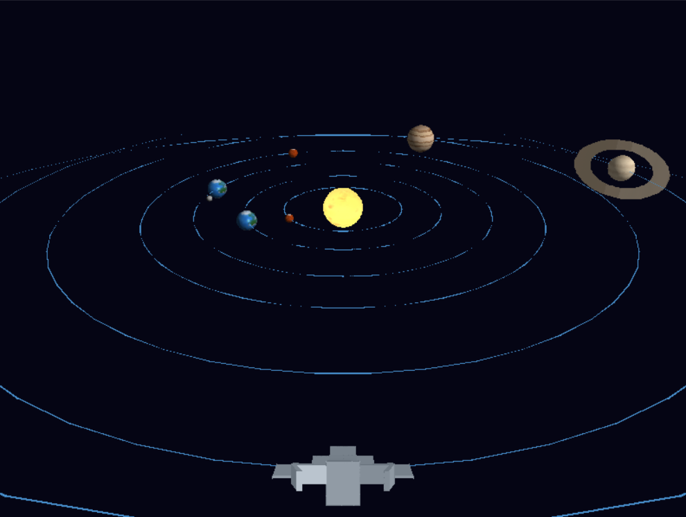
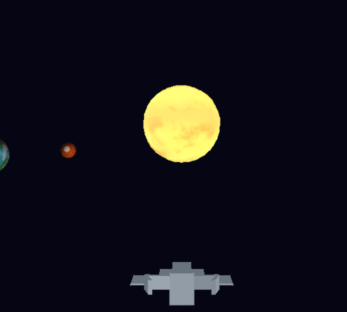
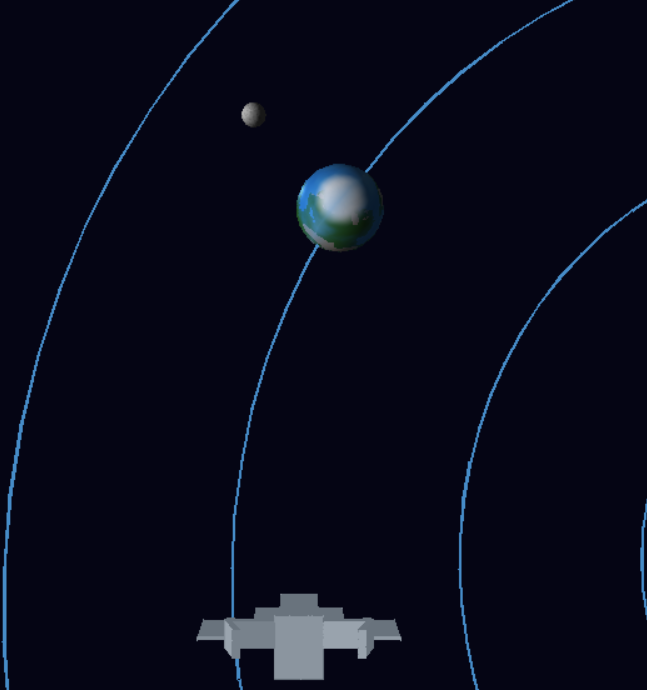
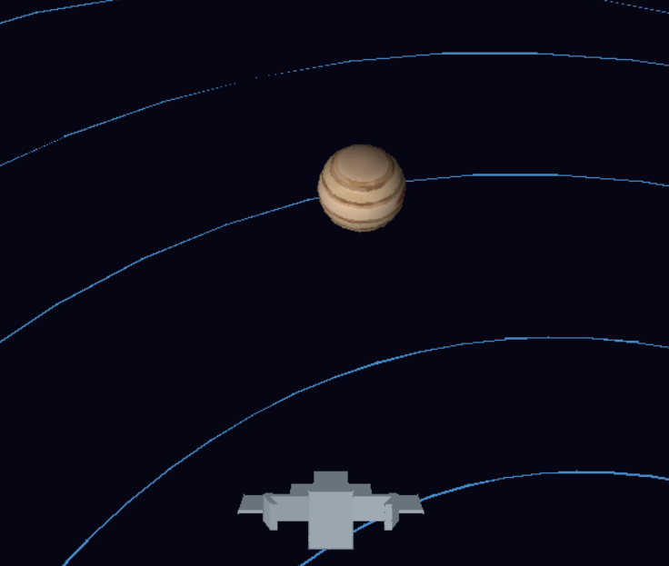
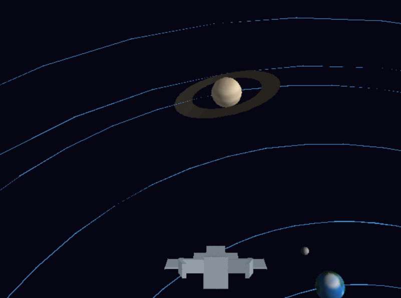
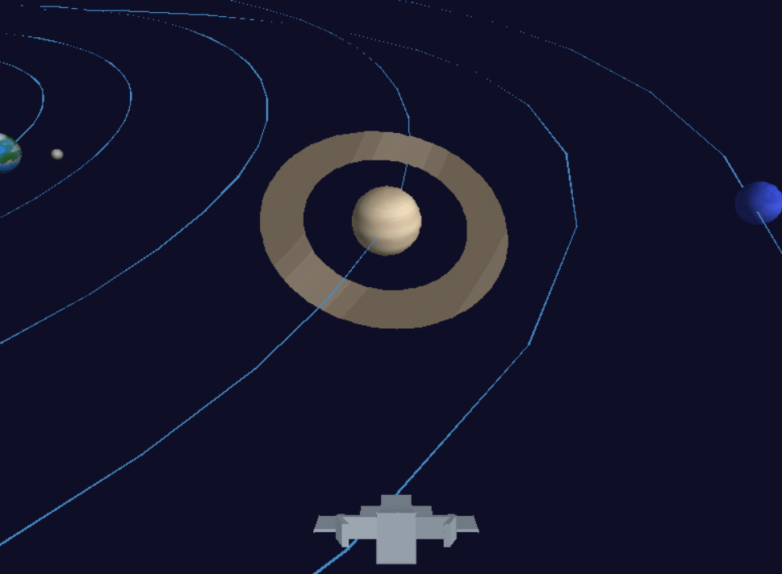
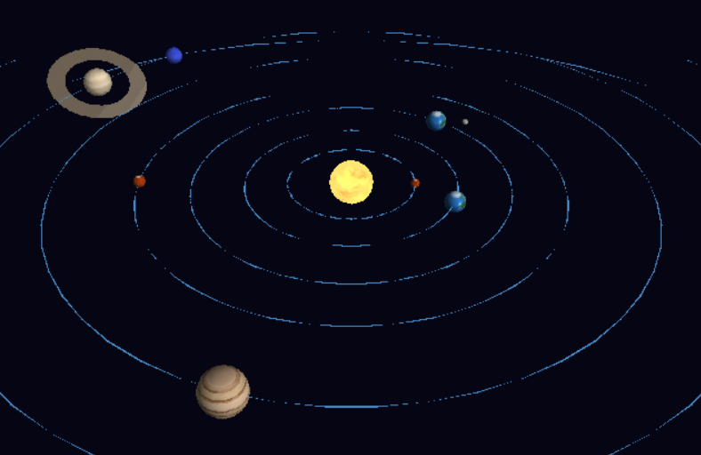
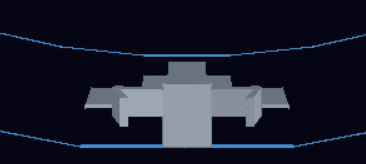

# 🌌 Sistema Solar - Simulación Interactiva 3D

Simulación del sistema solar renderizada desde cero con un motor gráfico personalizado en Rust. Proyecto desarrollado para el curso de Gráficas por Computadora - Universidad del Valle de Guatemala.


## 🎥 Video Demo

[](link-a-tu-video)

---

## ✨ Características Implementadas

### 🪐 Sistema Planetario Completo
- **8 planetas únicos** con shaders procedurales personalizados
- **Sol** con efectos de manchas solares, erupciones y corona animada
- **Luna** orbitando la Tierra con cráteres realistas
- **Anillos de Saturno** con bandas y transparencia

### 🎨 Shaders Procedurales (Multi-capa)
Cada cuerpo celeste tiene un shader único con múltiples capas de efectos:

- **☀️ Sol**: Manchas solares, granulación, erupciones animadas, corona
- **🔴 Marte**: Superficie rocosa, cráteres realistas, casquetes polares
- **🌍 Tierra**: Océanos, continentes, nubes animadas, atmósfera, especular
- **🟠 Júpiter**: Bandas atmosféricas, turbulencia, Gran Mancha Roja
- **🪐 Saturno**: Bandas sutiles, hexágono polar, tonos crema/dorado
- **🔵 Neptuno**: Tono azul intenso, tormentas, variación latitudinal
- **🌙 Luna**: Cráteres circulares, mares lunares, variación de terreno

### 🚀 Sistema de Navegación
- **Movimiento 3D completo** (WASD + Space/Shift)
- **Rotación libre** de cámara (flechas direccionales)
- **Sistema de seguimiento** de planetas
- **Warp instantáneo** con animación suave (1 segundo)
- **Detección de colisiones** - imposible atravesar planetas

### 🎯 Órbitas y Física
- **Órbitas elípticas visibles** para cada planeta
- **Velocidades orbitales realistas** (planetas lejanos más lentos)
- **Rotación sobre eje propio** de cada planeta
- **Sistema de satélites** (Luna orbita la Tierra)

### ⚡ Optimizaciones
- **Frustum culling** - no renderiza objetos fuera de vista
- **Distance culling** - objetos muy cercanos/lejanos no se renderizan
- **LOD para órbitas** - menos detalle en órbitas lejanas
- **Z-buffer optimizado** - previene glitches al atravesar objetos

---

## 🎮 Controles

### Selección y Navegación
| Tecla | Acción |
|-------|--------|
| `1-8` | Seleccionar planeta (1=Mercurio ... 8=Neptuno) |
| `TAB` | 🌀 Warp al planeta seleccionado |
| `R` | Resetear cámara (volver al Sol) |

### Movimiento 3D
| Tecla | Acción |
|-------|--------|
| `W` | Mover adelante |
| `S` | Mover atrás |
| `A` | Mover izquierda |
| `D` | Mover derecha |
| `Space` | Subir |
| `Shift` | Bajar |

### Rotación de Cámara
| Tecla | Acción |
|-------|--------|
| `↑` | Mirar arriba |
| `↓` | Mirar abajo |
| `←` | Mirar izquierda |
| `→` | Mirar derecha |
| `Q` | Zoom in |
| `E` | Zoom out |

### Sistema
| Tecla | Acción |
|-------|--------|
| `ESC` | Salir |

---

## 🛠️ Tecnologías

### Stack Principal
- **Rust** - Lenguaje de programación
- **minifb** - Manejo de ventana y framebuffer
- **nalgebra-glm** - Matemáticas 3D (vectores, matrices)
- **tobj** - Carga de modelos OBJ

### Arquitectura
```
src/
├── main.rs              # Loop principal y renderizado
├── camera.rs            # Sistema de cámara 3D
├── framebuffer.rs       # Buffer de píxeles y z-buffer
├── shaders.rs           # Vertex & Fragment shaders
├── celestial/           # Sistema planetario
│   ├── planet.rs        # Estructura de planetas
│   ├── solar_system.rs  # Gestor del sistema
│   └── orbit.rs         # Cálculos orbitales
├── spacecraft/          # Nave espacial
│   └── ship.rs          # Lógica de la nave
├── effects/             # Efectos visuales
│   ├── orbit_renderer.rs
│   └── warp_effect.rs
└── utils/               # Utilidades
    └── collision.rs     # Detección de colisiones
```

---

## 📦 Instalación

### Prerequisitos
- Rust 1.70 o superior
- Cargo

### Pasos

1. **Clonar el repositorio**
```bash
git clone https://github.com/tu-usuario/sistema-solar.git
cd sistema-solar
```

2. **Asegurar que tienes los modelos**
```
assets/models/
├── sphere.obj
└── spaceship.obj
```

3. **Compilar y ejecutar**
```bash
cargo run --release
```

> **Nota**: Usa `--release` para mejor performance (60 FPS constantes)


## 🌟 Aspectos Técnicos Destacados

### Pipeline de Renderizado
1. **Vertex Shader**: Transformación de vértices (Model → World → View → Projection)
2. **Rasterización**: Conversión de triángulos a fragmentos
3. **Fragment Shader**: Shaders procedurales multi-capa por píxel
4. **Z-Buffer**: Test de profundidad para orden correcto

### Shaders Procedurales
Los shaders están implementados sin texturas, usando:
- **Fractal Brownian Motion (FBM)** para ruido procedural
- **Noise functions** personalizadas
- **Mapeo UV esférico** desde normales
- **Múltiples capas** combinadas con interpolación

### Sistema de Órbitas
- Órbitas calculadas con **ecuaciones paramétricas**
- **Inclinación orbital** configurable
- **Velocidades proporcionales** a distancia del sol
- Renderizado optimizado con **LOD dinámico**

---

## 📸 Screenshots

### Vista General del Sistema


### Planetas Individuales
| Sol | Tierra | Júpiter | Saturno |
|-----|--------|---------|---------|
|  |  |  |  |

### Efectos Especiales
| Warp Effect | Órbitas | Nave |
|-------------|---------|------|
|  |  |  |

---

## 🚧 Mejoras Futuras

- [ ] Sistema de texturas para mayor realismo
- [ ] Skybox con estrellas (parcialmente implementado)
- [ ] Más satélites (lunas de Júpiter, Saturno)
- [ ] Cinturón de asteroides
- [ ] Sistema de partículas para efectos
- [ ] UI con información de planetas
- [ ] Modo cámara libre vs modo nave

---

## 👨‍💻 Autor

**Osman Emanuel de Leon García**
- Universidad del Valle de Guatemala
- Gráficas por Computadora - 2025
- [GitHub](https://github.com/tu-usuario)

---

## 📄 Licencia

Este proyecto fue desarrollado con fines educativos para el curso de Gráficas por Computadora.

---

## 🙏 Agradecimientos

- Modelos 3D: sphere.obj y spaceship.obj
- Inspiración: [JS Orrery](http://mgvez.github.io/jsorrery/)
- Universidad del Valle de Guatemala

---

## 🔗 Links

- [Repositorio](https://github.com/tu-usuario/sistema-solar)
- [Video Demo](link-al-video)
- [Documentación de Rust](https://www.rust-lang.org/)

---

**Hecho con ❤️ y Rust 🦀**